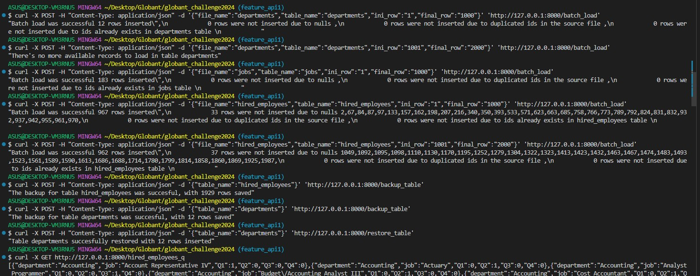

# globant_challenge2024
### Public repository dedicated to Coding Challenge requested by Globant data engineer role

#### Intend
The objective of this repository is to solve the Coding Challenge proposed by Globant, which is described in Proposal for coding challenge.pdf. In summary, the challenge has two main tasks:

1. Create an API to load data into tables in batch, create a table backup in AVRO format and restore a table with its backup.
2. Create endpoint to solve two business questions using the data that was inserted in the previous item.

#### Challenge approach
Summary
* Python as main programming language.
* The API is built on top of Python, under the framework FastAPI. 
* The database is SQLlite3. 
* Connection to the database through sqlalchemy.
* Development was on the local machine.

Challenge 1
Three POST methods to insert data restored and do a backup table
* (POST) {"file_name":"xxx","table_name":"xxx","ini_row":"1","final_row":"1000"} localhost/batch_load -> insert new data into tables
* (POST) {"table_name":"xxx"} localhost/backup_table -> create a backup of a table in AVRO format
* (POST) {"table_name":"xxx"} localhost/restore_table -> restore a table using its backup file

Challenge 2
Two get methods to retrieve stakeholders requirements. The response is in json format. The metrics are calculated using a SQL query
* (GET)  localhost/hired_employees_q -> get metrics of hired employees by quarter for 2021. 
* (GET)  localhost/hired_employees_dep -> get metrics hired employees by department greater that 2021 avg

#### Repository content

| File |  Description |
| ------------- | -------------|
| app.py| source code for the FASTAPI |
| db.py| creates the database and tables in sqlite3|
| globant.db | sqlite database |
| Dockerfile | dockerfile to deploy the package *(draft version)* |
| Proposal for coding challenge.pdf |  Instrucctions for coding challenge |
| metrics | folder with csv files wich have the query results for challenge 2. *Only for visualization purposes* |
| bck| folder with table backups in AVRO format *location where backup_table method saves the result* |
| historical_data |  folder with csv files with historical data to load into sqlite tables |

#### Commands 
The following commands shows how to call the API

- Create database and tables in sqlite3: 
`python db.py`

- Initialize API and auto update for changes: 
`uvicorn app:app_globant --reload`

**Challenge 1**
- Call post method to ingest historical data: 
`curl -X POST -H "Content-Type: application/json" -d '{"file_name":"departments","table_name":"departments","ini_row":"1","final_row":"1000"}' 'http://127.0.0.1:8000/batch_load'` 

- Call post method to create a backup table in avro format
`curl -X POST -H "Content-Type: application/json" -d '{"table_name":"departments"}' 'http://127.0.0.1:8000/backup_table'` 

- Call post method to restore table
`curl -X POST -H "Content-Type: application/json" -d '{"table_name":"departments"}' 'http://127.0.0.1:8000/restore_table'` 

**Challenge 2**
- Call get method to get metrics hired employees by quarter
`curl -X GET http://127.0.0.1:8000/hired_employees_q` 

- Call get method to get metrics hired employees by department greater that 2021 mean
`curl -X GET http://127.0.0.1:8000/hired_employees_dep` 

#### Evidence
The following screenshot shows that app_globant is functional

#### *Deployment (Draft)*
Repository includes a basic Dockerfile that is not yet functional 
`docker build -t globant_challenge .` 
